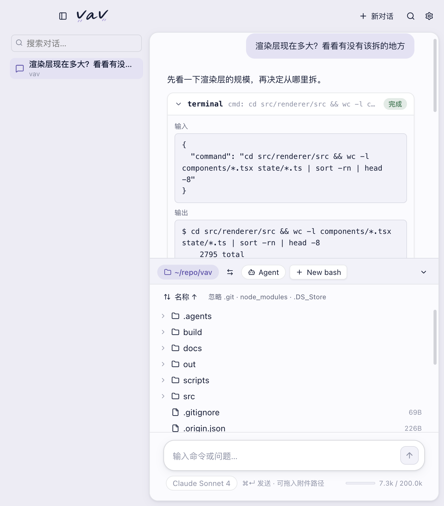

<picture>
  <source media="(prefers-color-scheme: dark)" srcset="docs/wordmark-dark.png">
  
</picture>

<br/>

<!-- originai-release-badge:start -->
<a href="https://spec.getoriginai.com/feea5b82-31bd-4418-a57f-23bc4042e8ff/8c856bf1023a6e68b0d9843ca32da57589a8b1fd3a0bed70d1262a4745b7abe7" target="_blank" rel="noopener noreferrer"></a>
<!-- originai-release-badge:end -->


Local-first **CLI agent terminal workspace**. Host Claude Code, Codex, Cursor, Grok, and other agent CLIs in multi-split PTYs with an integrated file tree — vav does **not** run its own agent loop.

Pick an agent binary, spawn it in a terminal pane, and work in raw shell I/O. Everything stays on your machine; each CLI agent manages its own auth.



## Features

- **Multi-split PTY terminal** (⌘D / ⌘T / ⌘W) — each pane is an independent bash session
- **CLI agent host** — Claude Code, Codex, Cursor, Pi, Grok, Devin pre-configs + custom binaries (Settings → CLI Agents)
- **Integrated file tree** with Quick Look and format-aware previews
- **Real PTY tabs**: node-pty + xterm.js — `top` and `vim` work; the agent opens its own bash session on first command
- **File tree**: on-demand expand, agent edits highlighted, spacebar Quick Look; tree or column view
- **Per-session working directory**, defaulting to a temporary workspace you can point at a real project; `vav .` / `vav /path` CLI open
- **English / Chinese UI**, following the OS or a setting
- **Anthropic and OpenAI-compatible** APIs, with a customizable endpoint
- API keys stored encrypted via `safeStorage` (Keychain) — never as plaintext

## Website

The static site lives in [`site/`](site/) and is published to GitHub Pages by Actions:

https://vavapp.com  
(also https://21stware.github.io/vav/)

Bilingual (toggle in the top-right; default follows the browser language, and `?lang=zh` pins it). Marketing screenshots are captured with the English UI (chat / files / terminal / context):

```bash
node scripts/capture-marketing-screenshot.mjs
```

Writes `docs/screenshot.png` (README hero) and `site/assets/screenshot-*.png` (site gallery), then
derives the AVIF/WebP variants the site actually serves. The PNGs stay as the `<picture>` fallback.
If you edit `site/assets/*.png` by hand, regenerate the variants or visitors keep the old ones:

```bash
npm run site:images        # add -- --force to rebuild everything
npm run brand:icons        # rebuild Windows .ico + site favicon from build/icon.png
```

Custom domain: `vavapp.com` (see `site/CNAME`). Apex uses GitHub Pages `A`/`AAAA` records; `www` is a `CNAME` to `21stware.github.io`. Keep Cloudflare proxy **DNS only** (grey cloud) so GitHub can issue HTTPS.

## Install

Grab a build from [Releases](https://github.com/21stware/vav/releases).

- **macOS** — Developer ID signed and notarized; open the DMG and drag to Applications. Later versions update in-app (About → Check for Updates).
- **Windows** — not code-signed; SmartScreen may warn on first open (More info → Run anyway). In-app updates use the NSIS installer feed.

Then in Settings → “vav command”, install the `vav` CLI (defaults to `~/.local/bin`). Run `vav -h` for usage; `vav .` opens a new session in the current directory.

## Develop

Requires Node 20+, macOS or Windows.

```bash
npm install
npm run dev
```

Package (native modules mean you only build for the platform you’re on):

```bash
npm run dist        # macOS → release/vav-*-macos-arm64.dmg (signed + notarized when credentials are set)
npm run dist:win    # Windows → release/vav-*-windows-x64-setup.exe
```

First launch asks for an API key (⌘, / Ctrl+,). File tree and terminal work before that; only agent turns need a key.

## Shortcuts

⌘ on macOS, Ctrl on Windows; in-app hints switch automatically.

| Action | Key |
| --- | --- |
| New session | ⌘N |
| Send | ⌘↩ |
| Cancel current turn | Esc |
| Search in session | ⌘F |
| New terminal tab | ⌘T |
| Toggle sidebar / tools panel | ⌘⇧H / ⌘⇧E |
| Settings | ⌘, |

A global hotkey can be recorded under Appearance; off by default.

## Platform differences

Most things match; these are OS differences, not missing features:

| | macOS | Windows |
| --- | --- | --- |
| Agent & terminal shell | zsh / bash / fish | PowerShell |
| Closing the main window | Hides; turns and PTYs keep running; Dock restores | Quits for real (no Dock to restore from) |
| Space in the file tree | Quick Look | Opens with the system default app |
| Default global hotkey | ⌃⌘Space | Ctrl+Alt+Space |

## Layout

```
src/
  shared/      domain types, IPC contracts, i18n
  main/
    store/     settings, secrets, conversation persistence
    agent/     LLM client, tool defs, turn loop
    terminal/  sticky shell, PTY management
    fs/        file listing and watchers
    cli.ts     `vav` command install and open-path parsing
  preload/     contextBridge `window.vav`
  renderer/    React UI, zustand stores, stream projection
```

Implementation notes: [docs/TECH_DESIGN.md](docs/TECH_DESIGN.md). Product behavior is specified in RPML via Origin and pulled by `.agents/skills/origin-product-spec-management` into `.agents/specs/` (not checked in).

## License

Dual-licensed — see [NOTICE](NOTICE) and [LICENSE](LICENSE).

- **Noncommercial (free):** [PolyForm Noncommercial 1.0.0](LICENSE).
  Download, study, personal customization, and noncommercial redistribution are allowed; keep the `Required Notice` and upstream repo
  https://github.com/21stware/vav.
- **Commercial (paid):** Selling, white-labeling, embedding in a paid product/service, or any commercial customization / commercial use
  requires a **commercial license** from the copyright holder. Contact: licensing@21stware.com.
